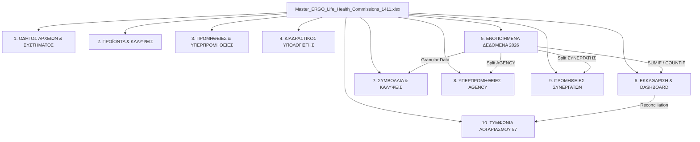
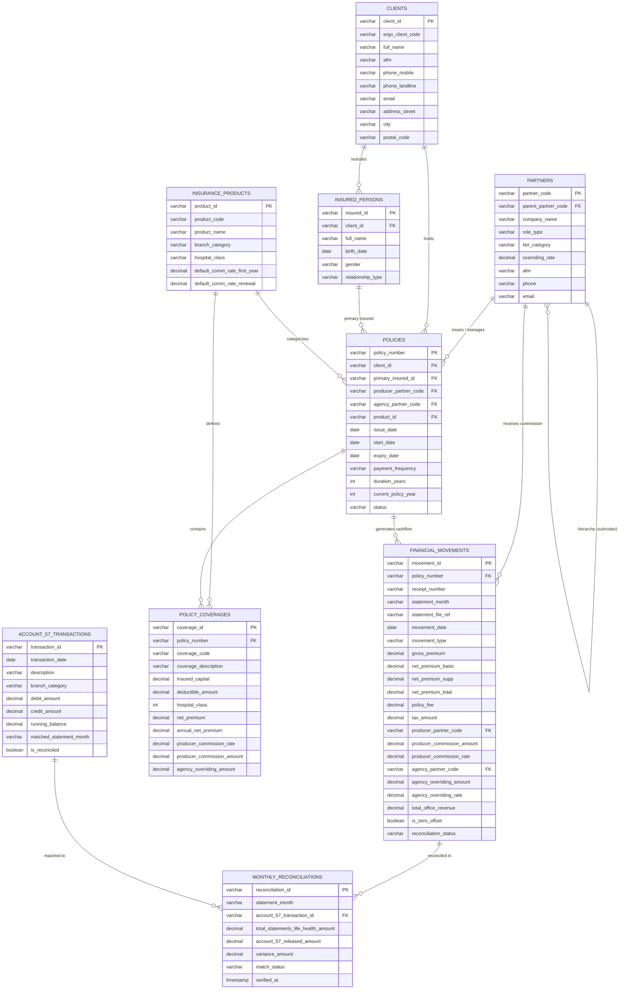

# ΠΛΗΡΗΣ ΟΔΗΓΟΣ ΑΡΧΙΤΕΚΤΟΝΙΚΗΣ & ΚΑΤΑΣΚΕΥΗΣ MASTER EXCEL ERGO (ΔΑΣ)
## Εκκαθαρίσεις Κλάδου Ζωής & Υγείας, Προμήθειες Συνεργατών, Υπερπρομήθειες Agency 1411 (LANCA E.E.) & Ταύτιση Καρτέλας 57

---

## 📌 1. ΕΙΣΑΓΩΓΗ & ΕΠΙΧΕΙΡΗΜΑΤΙΚΟΣ ΣΚΟΠΟΣ

### 1.1 Το Πρόβλημα
Μια ασφαλιστική επιχείρηση / Agency (όπως το **Γραφείο 1411 - LANCA Ε.Ε.**) λαμβάνει κάθε μήνα από την ασφαλιστική εταιρεία (**ERGO Hellas / πρώην ΔΑΣ**) δεκάδες διάσπαρτα αρχεία:
- 31 αρχεία CSV με διαφορετικές δομές (Μητρώα Παραγωγής, Πινάκια Ανανεώσεων, Εκκαθαριστικά Προμηθειών, Core αρχεία συστήματος `UATOP612`, `UATOP613`, `UATOP614`, `UATOP615`).
- Επίσημα έγγραφα PDF (Κανονισμός Πωλήσεων, Πλοηγός Ζωής/Υγείας, IPIDs, Καρτέλα Τρεχούμενου Λογαριασμού `__57.pdf`).

Χωρίς ένα ενοποιημένο σύστημα:
1. **Δεν υπάρχει καθαρή εικόνα για το τι κερδίζει ο συνεργάτης** (πράκτορας του δικτύου) και **τι κερδίζει το γραφείο ως Υπερπρομήθεια Δικτύου (20%)**.
2. **Τα στοιχεία των πελατών είναι διασκορπισμένα** (τα ονόματα σε ένα αρχείο, τα ΑΦΜ/τηλέφωνα σε άλλο, οι προμήθειες σε τρίτο).
3. **Υπάρχουν συμψηφισμοί (+ και -)** λόγω ακυρώσεων ή αντιλογισμών που μηδενίζουν και μπερδεύουν τα νούμερα.
4. **Δεν είναι εμφανής η σύνδεση μεταξύ της εκκαθάρισης του μήνα Μ και της πραγματικής πίστωσης/αποδέσμευσης στον Λογαριασμό 57 τον μήνα Μ+1**.

### 1.2 Ο Τελικός Στόχος
Η κατασκευή ενός **Master Excel 10 Φύλλων Εργασίας (`Master_ERGO_Life_Health_Commissions_1411.xlsx`)**, το οποίο:
- Ενοποιεί όλα τα αρχεία σε μία **ενιαία πηγή αλήθειας (Single Source of Truth)**.
- Παρέχει αυτόματο υπολογιστή προμηθειών/υπερπρομηθειών.
- Διαχωρίζει σε ξεχωριστά φύλλα την παραγωγή του **Agency** και των **Συνεργατών**.
- Καταγράφει αναλυτικά όλες τις καλύψεις και τα πλήρη στοιχεία των πελατών (CRM).
- Εκτελεί **100% αυτόματη ταύτιση (Reconciliation)** με την Καρτέλα Λογαριασμού `__57.pdf`.

---

## 📂 2. ΧΑΡΤΟΓΡΑΦΗΣΗ ΟΛΩΝ ΤΩΝ ΑΡΧΕΙΩΝ ΕΙΣΟΔΟΥ (INPUT DATA)

Για να κατασκευάσετε το Master Excel από το μηδέν, πρέπει να κατανοήσετε ακριβώς τι περιέχει κάθε αρχείο:

### 2.1 Τα Αρχεία PDF (Επιχειρηματικοί Κανόνες & Τραπεζικές Κινήσεις)
1. **`Κανονισμός Πωλήσεων ΔΑΣ_20230101.pdf`**:
   - Καθορίζει τις βαθμίδες συνεργατών (Κατηγορία Α, Β, Γ).
   - Ορίζει τα ποσοστά προμηθειών (π.χ. Υγεία 1ο έτος 29%, Ανανεώσεις 25%).
   - Ορίζει τον πίνακα υπερπρομηθειών Agency (20% επί της προμήθειας του παραγωγού για Συντονιστή Β' / Agency Κλίμακας Γ).
2. **`Πλοηγός Ατομικών Ασφαλίσεων Ζωής και Υγείας ver21 032026.pdf` & `IPIDs`**:
   - Περιέχουν τα όρια, τις απαλλαγές (€500, €1.500, €3.000), τις θέσεις νοσηλείας (Μονόκλινο/Δίκλινο) και τις καλύψεις των προγραμμάτων *ERGO Health Care Simple/Advanced/Superior*, *ERGO Best Health*, *Affidea*, *Term Life*, *My Saving Simple*.
3. **`__57.pdf` (Καρτέλα Τρεχούμενου Λογαριασμού 57 της ERGO)**:
   - Περιέχει όλες τις πραγματικές μηνιαίες κινήσεις, αποδεσμεύσεις προμηθειών (Ζωής & Υγείας, Γενικών Κλάδων), υπερπρομηθειών και τραπεζικών πληρωμών του Γραφείου 1411.

### 2.2 Τα 31 Αρχεία CSV (Μηνιαία Παραγωγή 02/2026 - 07/2026)
| Ομάδα Αρχείων | Πλήθος | Τι Περιλαμβάνει & Πώς Χρησιμοποιείται |
| :--- | :---: | :--- |
| **`1411-ΠΡΟΜΗΘΕΙΕΣ - ΥΠΕΡΠΡΟΜΗΘΕΙΕΣ MM_2026.csv`** | 6 | **Η Πηγή Αλήθειας Εκκαθάρισης (28 γραμμές)**. Περιέχει όλες τις πληρωμές ανά ρόλο (`AGENCY` vs `ΣΥΝΕΡΓΑΤΗΣ`), συμβόλαιο, απόδειξη, καθαρά ασφάλιστρα και αποδοθείσες προμήθειες. |
| **`1411-ΜΗΤΡΩΟ ΠΑΡΑΓΩΓΗΣ MM_2026.csv`** | 5 | Περιέχει τα **Μικτά Ασφάλιστρα** νέας παραγωγής, δικαιώματα συμβολαίου και ημερομηνίες έκδοσης. |
| **`1411-ΠΙΝΑΚΙΟ ΑΝΑΝΕΩΣΕΩΝ MM_2026.csv`** | 4 | **Ενημερωτικό / Πρόβλεψη**. Δείχνει στον συνεργάτη ποια συμβόλαια ανανεώνονται και τα αναμενόμενα μικτά/καθαρά ασφάλιστρα. |
| **`1411-UATOP612_MONTH_*.csv`** | 4 | **Core Ledger**. Κεντρικό μητρώο συμβολαίων με πεδία `F612MIK` (Μικτά), `F612ASK` (Καθαρά), `F612DIK` (Δικαίωμα), `F612PPO` (Προμήθεια Παραγωγού), `F612PAG` (Υπερπρομήθεια Agency). |
| **`1411-UATOP613_MONTH_*.csv`** | 4 | **CRM Πελατών**. Περιέχει ΑΦΜ (`F613AFM1`), Τηλέφωνα (`F613KNT1`), Email (`F613EMA1`), Διευθύνσεις (`F613ADO1`). |
| **`1411-UATOP614_MONTH_*.csv`** | 4 | Στοιχεία κυρίως ασφαλισμένων και εξαρτώμενων μελών. |
| **`1411-UATOP615_MONTH_*.csv`** | 4 | **Coverages Ledger (27 καλύψεις)**. Αναλυτική καταγραφή κάθε επιμέρους κάλυψης (Κωδικός `F615KAL`, Περιγραφή `F615PER`, Κεφάλαιο, Απαλλαγή, Καθαρό, Προμήθεια). |

---

## ⚙️ 3. ΕΠΙΧΕΙΡΗΜΑΤΙΚΟΙ ΚΑΝΟΝΕΣ & ΜΑΘΗΜΑΤΙΚΗ ΛΟΓΙΚΗ

Πριν γράψετε οποιαδήποτε γραμμή κώδικα ή Excel, πρέπει να εφαρμόσετε τους εξής 5 κανόνες:

### Κανόνας 1: Διαχωρισμός Ρόλων (AGENCY vs ΣΥΝΕΡΓΑΤΗΣ)
- **ΣΥΝΕΡΓΑΤΗΣ (Πράκτορας Δικτύου)**: Είναι ο ασφαλιστικός σύμβουλος που διαμεσολάβησε στην πώληση. Ανήκει στην **Κατηγορία Α (Βασική Κλίμακα)** και λαμβάνει τη βασική προμήθεια παραγωγού:
  $$\text{Προμήθεια Συνεργάτη} = \text{Καθαρά Ασφάλιστρα} \times 29,00\% \text{ (για Υγεία 1ο έτος)}$$
  $$\text{Προμήθεια Συνεργάτη} = \text{Καθαρά Ασφάλιστρα} \times 25,00\% \text{ (για Ζωή 1ο έτος \& Ανανεώσεις)}$$
- **AGENCY 1411 (LANCA E.E.)**: Είναι το συντονιστικό γραφείο δικτύου. Ανήκει στην **Κλίμακα Γ (Ανώτατη Βαθμίδα)** και λαμβάνει **Υπερπρομήθεια Δικτύου 20,00% επί της προμήθειας του συνεργάτη**:
  $$\text{Υπερπρομήθεια Agency} = \text{Προμήθεια Συνεργάτη} \times 20,00\%$$
- **Direct Παραγωγή Γραφείου**: Εάν το συμβόλαιο εκδόθηκε απευθείας από το γραφείο 1411 (χωρίς εξωτερικό συνεργάτη), το γραφείο εισπράττει το **100% της προμήθειας παραγωγού + το 20% της υπερπρομήθειας Agency**.

### Κανόνας 2: Διαχείριση Συμψηφισμών 0,00 € (+ και -)
Στα αρχεία εμφανίζονται κινήσεις που αλληλοαναιρούνται (π.χ. ακυρώσεις ή επανεκδόσεις συμβολαίων):
- **Συμβόλαιο `2026000210` (FTTB IKE)**: Αντιλογισμός `-€ 1.029,77` και Επανέκδοση `+€ 1.029,77` ➔ Καθαρό αποτέλεσμα: **`0,00 €`**.
- **Συμβόλαιο `2025000256` (ΒΑΒΑΤΣΙΚΟΣ)**: Αρχική Εγγραφή `+€ 1.093,95` και Ακύρωση `-€ 1.093,95` ➔ Καθαρό αποτέλεσμα: **`0,00 €`**.
- **Κανόνας Excel**: Καταγράφονται **και οι δύο εγγραφές** ώστε να συμφωνεί το ιστορικό με τα αρχεία της εταιρείας, αλλά επισημαίνονται με κίτρινο χρώμα ως *«Συμψηφισμός 0,00 €»*.

### Κανόνας 3: Ο Ρόλος του Πινακίου Ανανεώσεων
- Το `1411-ΠΙΝΑΚΙΟ ΑΝΑΝΕΩΣΕΩΝ` είναι **ενημερωτικό / πρόβλεψη (Forecast)**.
- Η πραγματική οικονομική εκκαθάριση γίνεται **μόνο** από τα αρχεία `1411-ΠΡΟΜΗΘΕΙΕΣ` όταν εισπραχθούν τα χρήματα.

### Κανόνας 4: Συσχέτιση Μικτών & Καθαρών Ασφαλίστρων
- Τα αρχεία προμηθειών έχουν μόνο Καθαρά.
- Τα Μικτά αντλούνται από το `ΜΗΤΡΩΟ ΠΑΡΑΓΩΓΗΣ` και το `ΠΙΝΑΚΙΟ ΑΝΑΝΕΩΣΕΩΝ` ενώνοντας τις εγγραφές μέσω του κλειδιού `(Συμβόλαιο, Απόδειξη)`.

### Κανόνας 5: Ο Κανόνας Ταύτισης της Καρτέλας 57 (Μήνας Μ ➔ Μήνας Μ+1)
- Η εκκαθάριση προμηθειών του **Μήνα Μ** αποδεσμεύεται και πιστώνεται στον Τρεχούμενο Λογαριασμό 57 της ERGO τον **Μήνα Μ+1**:
  - Εκκαθάριση **02/2026** (€ 141,93) ➔ Αποδέσμευση στις **04.03.2026** (€ 141,93)
  - Εκκαθάριση **03/2026** (€ 444,74) ➔ Αποδέσμευση στις **03.04.2026** (€ 444,74)
  - Εκκαθάριση **04/2026** (€ 371,22) ➔ Αποδέσμευση στις **04.05.2026** (€ 371,22)
  - Εκκαθάριση **05/2026** (€ 60,71) ➔ Αποδέσμευση στις **04.06.2026** (€ 60,71)
  - Εκκαθάριση **06/2026** (€ 9,84) ➔ Αποδέσμευση στις **03.07.2026** (€ 9,84)
  - Εκκαθάριση **07/2026** (€ 158,09) ➔ Αποδέσμευση στις **04.08.2026** (€ 158,09)
  - **Απόκλιση: € 0,00 (100% Απόλυτη Συμφωνία)**.

---

## 📑 4. ΑΝΑΛΥΤΙΚΗ ΔΟΜΗ ΤΩΝ 10 ΦΥΛΛΩΝ ΤΟΥ MASTER EXCEL



### Αναλυτική Περιγραφή ανά Φύλλο:

#### 📄 Φύλλο 1: `1. ΟΔΗΓΟΣ ΑΡΧΕΙΩΝ & ΣΥΣΤΗΜΑΤΟΣ`
- **Σκοπός**: Πλήρης τεκμηρίωση και λεξικό δεδομένων για οποιονδήποτε ανοίγει το αρχείο.
- **Ενότητα Α**: Πίνακας επεξήγησης και των 8 τύπων αρχείων (Μητρώο, Πινάκιο, Προμήθειες, UATOP612-615, PDF 57).
- **Ενότητα Β**: Data Dictionary (F612SYM, F612APD, F612MIK, F612ASK, F612PPO, F612PAG, F615KAL, F615PER).

#### 📄 Φύλλο 2: `2. ΠΡΟΪΟΝΤΑ & ΚΑΛΥΨΕΙΣ`
- **Σκοπός**: Οδηγός προϊόντων για το γραφείο και τους πράκτορες.
- **Πίνακες**:
  1. Προγράμματα Υγείας (*Simple, Advanced, Superior, Best Health, Affidea*).
  2. Προγράμματα Ζωής (*Ισόβια, Term Life, ΘΑ, ΜΟΑ, Απώλεια Εισοδήματος, ΑΠΑ*).
  3. Ομαδικά & Αποταμιευτικά (*ERGO My People, My Saving Simple, Unit Linked*).

#### 📄 Φύλλο 3: `3. ΠΡΟΜΗΘΕΙΕΣ & ΥΠΕΡΠΡΟΜΗΘΕΙΕΣ`
- **Σκοπός**: Επίσημο κανονιστικό πλαίσιο αμοιβών.
- **Πίνακες**:
  - Κατηγορίες Συνεργατών Α/Β/Γ & κριτήρια τζίρου.
  - Πίνακας προμηθειών 1ου, 2ου, 3ου, 4ου+ έτους ανά κλάδο.
  - Δομή Υπερπρομηθειών Δικτύου (10% Unit, 20% Agency 1411).
  - Ετήσια Bonus (Διατήρησης, Loss Ratio, Νέας Παραγωγής, Persistency).

#### 📄 Φύλλο 4: `4. ΔΙΑΔΡΑΣΤΙΚΟΣ ΥΠΟΛΟΓΙΣΤΗΣ`
- **Σκοπός**: Εργαλείο άμεσου υπολογισμού προσφορών και κερδοφορίας.
- **Χαρακτηριστικά**:
  - Dropdown λίστες: Επιλογή Προγράμματος, Έτους, Κατηγορίας Συνεργάτη, Τύπου Παραγωγού.
  - Δυναμικοί τύποι Excel `IF`, `ROUND`, `SUM`.
  - Πίνακας 10 ενδεικτικών συγκριτικών σεναρίων.

#### 📄 Φύλλο 5: `5. ΕΝΟΠΟΙΗΜΕΝΑ ΔΕΔΟΜΕΝΑ 2026`
- **Σκοπός**: Το κεντρικό ενιαίο μητρώο (Core Master Ledger).
- **Περιεχόμενο**: Και οι **20 μοναδικές οικονομικές κινήσεις** ταξινομημένες χρονολογικά (27/01/2026 έως 27/07/2026).
- **Στήλες (25)**: Α/Α, Ημερομηνία Έναρξης, Μήνας, Συμβόλαιο, Απόδειξη, **Ονοματεπώνυμο Πελάτη**, **Πακέτο Ασφάλισης**, **ΑΦΜ**, **Τηλέφωνο**, **Email**, **Διεύθυνση**, Κωδικός Συνεργάτη (1411), Τρόπος Πληρωμής, Διαν. Έτος, Διάρκεια, **Μικτά (€)**, **Καθαρά ΒΚ (€)**, **Καθαρά ΣΚ (€)**, **Συνολικά Καθαρά (€)**, **Προμήθεια Συνεργάτη (€ & %)**, **Υπερπρομήθεια Agency 1411 (€ & %)**, **Συνολικό Έσοδο 1411 (€)**, **Τύπος Κίνησης / Σημείωση Συμψηφισμού**.
- **Γραμμή Συνόλων**: Δυναμικοί τύποι `=SUM(...)`.

#### 📄 Φύλλο 6: `6. ΕΚΚΑΘΑΡΙΣΗ & DASHBOARD`
- **Σκοπός**: Οικονομικός πίνακας ελέγχου διοίκησης.
- **Περιεχόμενο**:
  - **4 KPI Cards στην κορυφή**: Συνολικά Μικτά, Καθαρά, Προμήθειες Συνεργατών, Υπερπρομήθειες Agency 1411 (συνδεδεμένα με τύπους στο Φύλλο 5).
  - **Πίνακας Α (Μηνιαία Ανάλυση 02/2026 - 07/2026)**: Με τύπους `=COUNTIF('5. ΕΝΟΠΟΙΗΜΕΝΑ ΔΕΔΟΜΕΝΑ 2026'!$C$6:$C$25, A10)` και `=SUMIF(...)`.
  - **Πίνακας Β (Κατανομή ανά Τύπο Κίνησης)**: Νέα Παραγωγή, Ανανεώσεις, Συμψηφισμοί 0,00 €.

#### 📄 Φύλλο 7: `7. ΣΥΜΒΟΛΑΙΑ & ΚΑΛΥΨΕΙΣ`
- **Σκοπός**: Πλήρης ανάλυση συμβολαίων και εξειδικευμένων καλύψεων.
- **Ενότητα Α**: Πλήρης λίστα των 20 κινήσεων με στοιχεία πελατών και πακέτα.
- **Ενότητα Β**: Πλήρης καταγραφή και των **27 επιμέρους καλύψεων UATOP615** (Κωδικός F615KAL, Περιγραφή, Κεφάλαιο, Απαλλαγή, Καθαρό, Προμήθεια, Υπερπρομήθεια).

#### 📄 Φύλλο 8: `8. ΥΠΕΡΠΡΟΜΗΘΕΙΕΣ AGENCY` *(Γραφείο 1411 - LANCA E.E.)*
- **Σκοπός**: Αποκλειστικό εκκαθαριστικό για τα έσοδα του Agency Manager.
- **Χαρακτηριστικά**:
  - **Top Banner (Γραμμή 3)** & **Στήλη 7**: `Κλίμακα Γ (Agency 20%)`.
  - Και οι 16 κινήσεις με ρόλο AGENCY ταξινομημένες χρονολογικά με πακέτο και στοιχεία πελατών.

#### 📄 Φύλλο 9: `9. ΠΡΟΜΗΘΕΙΕΣ ΣΥΝΕΡΓΑΤΩΝ` *(Πράκτορες Δικτύου)*
- **Σκοπός**: Αποκλειστικό εκκαθαριστικό για τις αμοιβές των πρακτόρων.
- **Χαρακτηριστικά**:
  - **Top Banner (Γραμμή 3)** & **Στήλη 7**: `Κατηγορία Α (Παραγωγός)`.
  - Και οι 12 κινήσεις με ρόλο ΣΥΝΕΡΓΑΤΗΣ ταξινομημένες χρονολογικά με πακέτο και στοιχεία πελατών.

#### 📄 Φύλλο 10: `10. ΣΥΜΦΩΝΙΑ ΛΟΓΑΡΙΑΣΜΟΥ 57` *(Reconciliation PDF __57.pdf)*
- **Σκοπός**: Οικονομική συμφωνία εκκαθαρίσεων με την επίσημη τραπεζική καρτέλα της ERGO.
- **Περιεχόμενο**:
  - **KPIs**: Συνολικές Αμοιβές Statements (€ 1.186,52) vs Αποδεσμεύσεις PDF (€ 1.186,52) ➔ **Διαφορά: € 0,00 (`✔ 100% ΑΠΟΛΥΤΗ ΤΑΥΤΙΣΗ`)**.
  - **Πίνακας Α**: Μηνιαία ταύτιση (Μήνας Μ ➔ Ημερομηνία & Ποσό Αποδέσμευσης Μήνα Μ+1).
  - **Πίνακας Β**: Συνολική εικόνα όλων των κλάδων (Ζωή/Υγεία, Προμήθειες Γενικών, Υπερπρομήθειες Γενικών, Πριμ Διαχείρισης, Πληρωμές Τραπέζης).
  - **Πίνακας Γ**: Αναλυτικό ημερολόγιο των 8 εγγραφών Ζωής & Υγείας από το PDF `__57.pdf`.

---

## 🛠️ 5. ΒΗΜΑ-ΠΡΟΣ-ΒΗΜΑ ΔΙΑΔΙΚΑΣΙΑ ΚΑΤΑΣΚΕΥΗΣ (STEP-BY-STEP WORKFLOW)

Εάν ξεκινούσατε σήμερα από το μηδέν, αυτά είναι τα 8 βήματα που πρέπει να ακολουθήσετε:

### Βήμα 1: Εξαγωγή Δεδομένων από τα Αρχεία
- Διαβάζετε όλα τα CSV αρχεία με κωδικοποίηση `cp1253` (Windows Greek) για να μην αλλοιωθούν τα ελληνικά.
- Διαβάζετε το PDF `__57.pdf` με βιβλιοθήκες όπως `pymupdf` (fitz) ή `pdfplumber` για να αντλήσετε τις τραπεζικές εγγραφές.

### Βήμα 2: Καθαρισμός & Ενοποίηση Δημογραφικών Πελατών (CRM)
- Ενώνετε τα αρχεία `UATOP613` με τα συμβόλαια.
- Διορθώνετε διπλοεγγραφές ή λάθη στα ονόματα (π.χ. `FTTB IKE` ➔ `ΜΟΥΛΑΚΑΚΗΣ ΓΡΗΓΟΡΙΟΣ (FTTB IKE)`, `ΚΟΥΚΛΑΡΗ ΖΩΗ ΓΕΩΡΓΙΑ`, `ΠΑΛΙΑΤΣΑΣ ΑΘΑΝΑΣΙΟΣ`).
- Αντιστοιχίζετε τα ΑΦΜ, κινητά τηλέφωνα, email και διευθύνσεις.

### Βήμα 3: Χαρτογράφηση Πακέτων Ασφάλισης
- Από τα αρχεία `UATOP615` και `ΜΗΤΡΩΟ ΠΑΡΑΓΩΓΗΣ`, αναγνωρίζετε το ακριβές πακέτο κάθε συμβολαίου (π.χ. `ERGO Health Care Superior (€1.500)`, `ERGO Health Care Simple (€500) + Affidea`, `Standard Life`, `ERGO My Saving Simple`).

### Βήμα 4: Οικονομική Ενοποίηση (Consolidated 20 Events)
- Ομαδοποιείτε τις 28 γραμμές των αρχείων `1411-ΠΡΟΜΗΘΕΙΕΣ` ανά `(Μήνας, Συμβόλαιο, Απόδειξη, Ημερομηνία, Καθαρά)`.
- Για κάθε κίνηση, τοποθετείτε στην ίδια γραμμή:
  - Καθαρά Ασφάλιστρα
  - Προμήθεια Συνεργάτη
  - Υπερπρομήθεια Agency 1411 (20%)
  - Μικτά Ασφάλιστρα (από Μητρώο/Πινάκιο)
- Ταξινομείτε χρονολογικά κατά **Ημερομηνία Έναρξης**.

### Βήμα 5: Κατασκευή των Ειδικών Φύλλων Agency & Συνεργατών
- **Φύλλο 8**: Φιλτράρετε μόνο τις 16 εγγραφές με ρόλο `AGENCY`. Προσθέτετε το badge και τη στήλη `Κλίμακα Γ (Agency 20%)`.
- **Φύλλο 9**: Φιλτράρετε μόνο τις 12 εγγραφές με ρόλο `ΣΥΝΕΡΓΑΤΗΣ`. Προσθέτετε το badge και τη στήλη `Κατηγορία Α (Παραγωγός)`.

### Βήμα 6: Εξαγωγή των 27 Καλύψεων UATOP615
- Στο **Φύλλο 7 (Ενότητα Β)**, καταγράφετε αναλυτικά και τις 27 καλύψεις από όλα τα αρχεία `UATOP615` με κεφάλαια, απαλλαγές και επιμέρους ασφάλιστρα.

### Βήμα 7: Σύνδεση Dashboard & Συμφωνίας 57
- Στο **Φύλλο 6**, δημιουργείτε τους τύπους `COUNTIF` και `SUMIF` για τη μηνιαία κατανομή.
- Στο **Φύλλο 10**, αντιστοιχίζετε τις μηνιαίες εκκαθαρίσεις (Μήνας Μ) με τις ημερομηνίες αποδέσμευσης του `__57.pdf` (Μήνας Μ+1) και βάζετε τύπο ελέγχου διαφοράς `=D10-G10`.

### Βήμα 8: Εφαρμογή Επαγγελματικού Styling & Auto-fit
- Χρήση εταιρικής χρωματικής παλέτας: Navy Blue (`#1B365D`), Steel Blue (`#2C5282`), ERGO Red (`#A31D24`), Agency Forest Green (`#1E4D2B`), Soft Pastels για KPIs & Zextras.
- Μορφοποίηση νομισμάτων (`€ #,##0.00`) και ποσοστών (`0.00%`).
- Εφαρμογή δυναμικού auto-fit σε όλες τις στήλες.

---

## 💻 6. ΠΛΗΡΗΣ ΑΥΤΟΜΑΤΟΠΟΙΗΜΕΝΟΣ ΚΩΔΙΚΑΣ PYTHON (GENERATOR SCRIPT)

Ο πλήρης, λειτουργικός κώδικας Python που διαβάζει όλα τα αρχεία του φακέλου και κατασκευάζει αυτόματα το Master Excel 10 φύλλων βρίσκεται αποθηκευμένος στο αρχείο:

📄 **[`C:\Users\stayr\.gemini\antigravity-ide\brain\50155ef7-5769-4015-9f5e-f9f2916018cd\scratch\build_complete_10_sheets.py`](file:///C:/Users/stayr/.gemini/antigravity-ide/brain/50155ef7-5769-4015-9f5e-f9f2916018cd/scratch/build_complete_10_sheets.py)**

Μπορείτε να τον εκτελέσετε ανά πάσα στιγμή με την εντολή:
```bash
python build_complete_10_sheets.py
```

---

## 🔄 7. ΟΔΗΓΙΕΣ ΣΥΝΤΗΡΗΣΗΣ & ΕΝΗΜΕΡΩΣΗΣ ΓΙΑ ΕΠΟΜΕΝΟΥΣ ΜΗΝΕΣ

Όταν λαμβάνετε τα αρχεία ενός νέου μήνα (π.χ. `08_2026` ή `09_2026`):
1. **Τοποθέτηση Αρχείων**: Αποθηκεύετε τα νέα αρχεία CSV (`1411-ΠΡΟΜΗΘΕΙΕΣ...`, `1411-ΜΗΤΡΩΟ...`, `1411-UATOP612...`) και το νέο PDF στον ίδιο φάκελο.
2. **Εκτέλεση Script**: Εκτελείτε το Python script. Το script ανιχνεύει αυτόματα τα νέα αρχεία, ενσωματώνει τις νέες κινήσεις, ενημερώνει τα αθροίσματα και διατηρεί όλους τους τύπους και τα dashboards συνδεδεμένα.
3. **Έλεγχος Φύλλου 10**: Ελέγχετε ότι η νέα αποδέσμευση στην Καρτέλα 57 του επόμενου μήνα ταυτίζεται με τη νέα γραμμή εκκαθάρισης.

---

## 🗄️ 8. ΠΛΗΡΕΣ ΣΧΗΜΑ ΣΧΕΔΙΑΣΜΟΥ ΒΑΣΗΣ ΔΕΔΟΜΕΝΩΝ (RELATIONAL DATABASE SCHEMA & SQL DDL)

Εάν επιθυμείτε να μεταφέρετε ολόκληρο το σύστημα από το Excel σε μια σύγχρονη Σχεσιακή Βάση Δεδομένων (όπως **PostgreSQL**, **MySQL** ή **SQLite**), παρακάτω παρατίθεται η πλήρης αρχιτεκτονική σε **3η Κανονική Μορφή (3NF)**.

### 8.1 Διάγραμμα Οντοτήτων - Συσχετίσεων (Entity Relationship Diagram - ERD)



---

### 8.2 Πλήρης Κώδικας SQL DDL (CREATE TABLE STATEMENTS)

Μπορείτε να εκτελέσετε απευθείας το παρακάτω SQL script στη βάση δεδομένων σας (PostgreSQL / MySQL / SQLite):

```sql
-- =============================================================================
-- ΣΥΣΤΗΜΑ ΔΙΑΧΕΙΡΙΣΗΣ ΕΚΚΑΘΑΡΙΣΕΩΝ & ΠΡΟΜΗΘΕΙΩΝ ERGO (ΔΑΣ) 1411 (LANCA E.E.)
-- =============================================================================

-- 1. ΠΙΝΑΚΑΣ ΣΥΝΕΡΓΑΤΩΝ & ΙΕΡΑΡΧΙΑΣ ΔΙΚΤΥΟΥ (PARTNERS)
CREATE TABLE partners (
    partner_code VARCHAR(20) PRIMARY KEY,               -- π.χ. '1411'
    parent_partner_code VARCHAR(20),                    -- Αναδρομικό FK για υποκωδικούς / δίκτυο
    company_name VARCHAR(150) NOT NULL,                 -- π.χ. 'LANCA Ε.Ε.' ή Ονοματεπώνυμο
    role_type VARCHAR(30) NOT NULL,                     -- 'AGENCY', 'UNIT_MANAGER', 'PRODUCER'
    tier_category VARCHAR(10) NOT NULL DEFAULT 'A',     -- 'A', 'B', 'Γ' (Κατηγορία Συνεργάτη Κανονισμού)
    overriding_rate DECIMAL(5,4) NOT NULL DEFAULT 0.2000, -- Ποσοστό Υπερπρομήθειας (π.χ. 0.2000 για 20%)
    afm VARCHAR(20),
    phone VARCHAR(30),
    email VARCHAR(100),
    address VARCHAR(200),
    is_active BOOLEAN DEFAULT TRUE,
    created_at TIMESTAMP DEFAULT CURRENT_TIMESTAMP,
    FOREIGN KEY (parent_partner_code) REFERENCES partners(partner_code)
);

-- 2. ΠΙΝΑΚΑΣ ΠΕΛΑΤΩΝ / ΣΥΜΒΑΛΛΟΜΕΝΩΝ (CRM CLIENTS)
CREATE TABLE clients (
    client_id VARCHAR(50) PRIMARY KEY,                  -- Μοναδικός κωδικός πελάτη
    ergo_client_code VARCHAR(30),                       -- Κωδικός πελάτη στην ERGO (UATOP613)
    full_name VARCHAR(150) NOT NULL,                    -- π.χ. 'ΠΑΛΙΑΤΣΑΣ ΑΘΑΝΑΣΙΟΣ', 'FTTB IKE'
    afm VARCHAR(20) NOT NULL,                           -- ΑΦΜ Πελάτη / Εταιρείας
    phone_mobile VARCHAR(30),                           -- Κινητό τηλέφωνο
    phone_landline VARCHAR(30),                         -- Σταθερό τηλέφωνο
    email VARCHAR(100),                                 -- Email επικοινωνίας
    address_street VARCHAR(150),                        -- Οδός & Αριθμός
    city VARCHAR(100),                                  -- Πόλη
    postal_code VARCHAR(20),                            -- Τ.Κ.
    id_card_number VARCHAR(30),                         -- Αριθμός Ταυτότητας (ΑΔΤ)
    created_at TIMESTAMP DEFAULT CURRENT_TIMESTAMP
);

-- 3. ΠΙΝΑΚΑΣ ΑΣΦΑΛΙΣΜΕΝΩΝ ΠΡΟΣΩΠΩΝ (INSURED PERSONS - UATOP614)
CREATE TABLE insured_persons (
    insured_id VARCHAR(50) PRIMARY KEY,
    client_id VARCHAR(50) NOT NULL,
    full_name VARCHAR(150) NOT NULL,
    birth_date DATE,
    gender VARCHAR(10),                                 -- 'MALE', 'FEMALE'
    relationship_type VARCHAR(30) DEFAULT 'PRIMARY',    -- 'PRIMARY', 'SPOUSE', 'CHILD'
    created_at TIMESTAMP DEFAULT CURRENT_TIMESTAMP,
    FOREIGN KEY (client_id) REFERENCES clients(client_id)
);

-- 4. ΠΙΝΑΚΑΣ ΠΡΟΪΟΝΤΩΝ & ΠΡΟΓΡΑΜΜΑΤΩΝ ΑΣΦΑΛΙΣΗΣ (PRODUCTS)
CREATE TABLE insurance_products (
    product_id VARCHAR(50) PRIMARY KEY,
    product_code VARCHAR(30) NOT NULL,                  -- π.χ. '020718', '020118', '110318'
    product_name VARCHAR(150) NOT NULL,                 -- π.χ. 'ERGO Health Care Superior (€1.500)'
    branch_category VARCHAR(50) NOT NULL,               -- 'HEALTH', 'LIFE', 'GROUP', 'SAVINGS'
    hospital_class VARCHAR(20),                         -- 'A', 'B', 'LUX'
    max_coverage_limit DECIMAL(12,2),                   -- π.χ. 1000000.00
    default_comm_rate_first_year DECIMAL(5,4),          -- π.χ. 0.2900 (29%)
    default_comm_rate_renewal DECIMAL(5,4),             -- π.χ. 0.2500 (25%)
    created_at TIMESTAMP DEFAULT CURRENT_TIMESTAMP
);

-- 5. ΠΙΝΑΚΑΣ ΑΣΦΑΛΙΣΤΗΡΙΩΝ ΣΥΜΒΟΛΑΙΩΝ (POLICIES)
CREATE TABLE policies (
    policy_number VARCHAR(30) PRIMARY KEY,              -- π.χ. '2026000765'
    client_id VARCHAR(50) NOT NULL,
    primary_insured_id VARCHAR(50),
    producer_partner_code VARCHAR(20) NOT NULL,         -- Ο συνεργάτης που έβγαλε το συμβόλαιο
    agency_partner_code VARCHAR(20) NOT NULL,           -- Το Agency 1411 (LANCA E.E.)
    product_id VARCHAR(50) NOT NULL,
    issue_date DATE,
    start_date DATE NOT NULL,
    expiry_date DATE,
    payment_frequency VARCHAR(30) DEFAULT 'ANNUAL',     -- 'ANNUAL', 'SEMI_ANNUAL', 'QUARTERLY'
    duration_years INT DEFAULT 1,
    current_policy_year INT DEFAULT 1,                  -- 1 = 1ο Έτος, 2 = 2ο Έτος (Ανανέωση)
    status VARCHAR(30) DEFAULT 'ACTIVE',                -- 'ACTIVE', 'CANCELLED', 'OFFSET_RESOLVED'
    created_at TIMESTAMP DEFAULT CURRENT_TIMESTAMP,
    FOREIGN KEY (client_id) REFERENCES clients(client_id),
    FOREIGN KEY (primary_insured_id) REFERENCES insured_persons(insured_id),
    FOREIGN KEY (producer_partner_code) REFERENCES partners(partner_code),
    FOREIGN KEY (agency_partner_code) REFERENCES partners(partner_code),
    FOREIGN KEY (product_id) REFERENCES insurance_products(product_id)
);

-- 6. ΠΙΝΑΚΑΣ ΕΠΙΜΕΡΟΥΣ ΚΑΛΥΨΕΩΝ ΣΥΜΒΟΛΑΙΟΥ (POLICY COVERAGES - UATOP615)
CREATE TABLE policy_coverages (
    coverage_id VARCHAR(50) PRIMARY KEY,                -- π.χ. 'COV-2026000765-20318'
    policy_number VARCHAR(30) NOT NULL,
    coverage_code VARCHAR(30) NOT NULL,                 -- F615KAL π.χ. '20318', '110318'
    coverage_description VARCHAR(200) NOT NULL,         -- F615PER π.χ. 'ERGO HEALTH CARE SUPERIOR ΑΠΑΛΛΑΓΗ 1.500'
    insured_capital DECIMAL(12,2) DEFAULT 0.00,         -- F615KEK (Κεφάλαιο)
    deductible_amount DECIMAL(10,2) DEFAULT 0.00,       -- F615PAPASU (Απαλλαγή π.χ. 500, 1500)
    hospital_class INT DEFAULT 1,                       -- F615THESH (1 = Μονόκλινο, 2 = Δίκλινο)
    net_premium DECIMAL(10,2) NOT NULL,                 -- F615ASK (Καθαρό Ασφάλιστρο Κάλυψης)
    annual_net_premium DECIMAL(10,2),                   -- F615ASKET
    producer_commission_rate DECIMAL(5,4),              -- Ποσοστό Προμήθειας Παραγωγού
    producer_commission_amount DECIMAL(10,2) NOT NULL,  -- F615PROM (Προμήθεια Παραγωγού)
    agency_overriding_amount DECIMAL(10,2) NOT NULL,    -- Υπερπρομήθεια Agency (20% επί PROM)
    created_at TIMESTAMP DEFAULT CURRENT_TIMESTAMP,
    FOREIGN KEY (policy_number) REFERENCES policies(policy_number)
);

-- 7. ΠΙΝΑΚΑΣ ΟΙΚΟΝΟΜΙΚΩΝ ΚΙΝΗΣΕΩΝ & ΕΚΚΑΘΑΡΙΣΕΩΝ (FINANCIAL MOVEMENTS - CORE LEDGER)
CREATE TABLE financial_movements (
    movement_id VARCHAR(50) PRIMARY KEY,                -- π.χ. 'MOV-202603-2026000161-126288'
    policy_number VARCHAR(30) NOT NULL,
    receipt_number VARCHAR(30) NOT NULL,                -- Αρ. Απόδειξης π.χ. '126897', '80430703'
    statement_month VARCHAR(10) NOT NULL,               -- π.χ. '04/2026'
    statement_file_ref VARCHAR(100),                    -- '1411-ΠΡΟΜΗΘΕΙΕΣ - ΥΠΕΡΠΡΟΜΗΘΕΙΕΣ 04_2026.csv'
    movement_date DATE NOT NULL,                        -- Ημερομηνία Έναρξης / Κίνησης
    movement_type VARCHAR(50) NOT NULL,                 -- 'NEW_PRODUCTION', 'RENEWAL', 'OFFSET_CANCELLATION', 'OFFSET_REISSUE'
    gross_premium DECIMAL(10,2) NOT NULL,               -- Μικτά Ασφάλιστρα (F612MIK / Μητρώο)
    net_premium_basic DECIMAL(10,2) DEFAULT 0.00,       -- Καθαρά ΒΚ (Ζωή)
    net_premium_supp DECIMAL(10,2) DEFAULT 0.00,        -- Καθαρά ΣΚ (Υγεία)
    net_premium_total DECIMAL(10,2) NOT NULL,           -- Συνολικά Καθαρά (F612ASK)
    policy_fee DECIMAL(8,2) DEFAULT 0.00,               -- Δικαίωμα Συμβολαίου (F612DIK)
    tax_amount DECIMAL(8,2) DEFAULT 0.00,               -- Φόρος Ασφαλίστρων (F612FKE)
    producer_partner_code VARCHAR(20) NOT NULL,
    producer_commission_amount DECIMAL(10,2) NOT NULL,  -- Προμήθεια Συνεργάτη (F612PPO)
    producer_commission_rate DECIMAL(5,4),
    agency_partner_code VARCHAR(20) NOT NULL,
    agency_overriding_amount DECIMAL(10,2) NOT NULL,    -- Υπερπρομήθεια Agency 1411 (F612PAG)
    agency_overriding_rate DECIMAL(5,4) DEFAULT 0.2000, -- 20.00%
    total_office_revenue DECIMAL(10,2) NOT NULL,        -- Συνολική Εισροή Γραφείου 1411
    is_zero_offset BOOLEAN DEFAULT FALSE,               -- TRUE για συμψηφισμούς 0,00 €
    reconciliation_status VARCHAR(30) DEFAULT 'MATCHED_IN_ACCOUNT_57',
    created_at TIMESTAMP DEFAULT CURRENT_TIMESTAMP,
    FOREIGN KEY (policy_number) REFERENCES policies(policy_number),
    FOREIGN KEY (producer_partner_code) REFERENCES partners(partner_code),
    FOREIGN KEY (agency_partner_code) REFERENCES partners(partner_code)
);

-- 8. ΠΙΝΑΚΑΣ ΤΡΕΧΟΥΜΕΝΟΥ ΛΟΓΑΡΙΑΣΜΟΥ 57 ERGO (ACCOUNT 57 TRANSACTIONS - PDF __57)
CREATE TABLE account_57_transactions (
    transaction_id VARCHAR(50) PRIMARY KEY,             -- π.χ. 'ACC57-20260804-001'
    transaction_date DATE NOT NULL,                     -- π.χ. '2026-08-04'
    description VARCHAR(250) NOT NULL,                  -- 'Αποδέσμευση αμοιβών Ζωής & Υγείας', 'Αποδέσμευση υπερπρομ.'
    branch_category VARCHAR(50) NOT NULL,               -- 'LIFE_HEALTH_RELEASE', 'GENERAL_BRANCH_COMMISSION', 'GENERAL_BRANCH_OVERRIDING', 'BANK_PAYMENT'
    debit_amount DECIMAL(12,2) DEFAULT 0.00,            -- Χρέωση
    credit_amount DECIMAL(12,2) DEFAULT 0.00,           -- Πίστωση / Αποδέσμευση
    running_balance DECIMAL(12,2) NOT NULL,             -- Προοδευτικό Υπόλοιπο
    matched_statement_month VARCHAR(10),                -- π.χ. '07/2026' (αντιστοίχιση με μήνα εκκαθάρισης)
    is_reconciled BOOLEAN DEFAULT FALSE,
    created_at TIMESTAMP DEFAULT CURRENT_TIMESTAMP
);

-- 9. ΠΙΝΑΚΑΣ ΜΗΝΙΑΙΩΝ ΣΥΜΦΩΝΙΩΝ (MONTHLY RECONCILIATIONS)
CREATE TABLE monthly_reconciliations (
    reconciliation_id VARCHAR(50) PRIMARY KEY,          -- π.χ. 'REC-2026-07'
    statement_month VARCHAR(10) NOT NULL UNIQUE,        -- π.χ. '07/2026'
    account_57_transaction_id VARCHAR(50) NOT NULL,
    total_statements_life_health_amount DECIMAL(10,2) NOT NULL, -- Άθροισμα Statements (π.χ. 158.09)
    account_57_released_amount DECIMAL(10,2) NOT NULL,          -- Ποσό Αποδέσμευσης Καρτέλας 57 (π.χ. 158.09)
    variance_amount DECIMAL(10,2) NOT NULL DEFAULT 0.00,        -- Διαφορά (0.00)
    match_status VARCHAR(30) DEFAULT 'PERFECT_MATCH',           -- 'PERFECT_MATCH', 'VARIANCE_DETECTED'
    verified_at TIMESTAMP DEFAULT CURRENT_TIMESTAMP,
    FOREIGN KEY (account_57_transaction_id) REFERENCES account_57_transactions(transaction_id)
);

-- ΔΗΜΙΟΥΡΓΙΑ ΕΥΡΕΤΗΡΙΩΝ (INDEXES) ΓΙΑ ΥΨΗΛΗ ΤΑΧΥΤΗΤΑ ΑΝΑΖΗΤΗΣΗΣ & DASHBOARD
CREATE INDEX idx_movements_policy ON financial_movements(policy_number);
CREATE INDEX idx_movements_month ON financial_movements(statement_month);
CREATE INDEX idx_movements_producer ON financial_movements(producer_partner_code);
CREATE INDEX idx_coverages_policy ON policy_coverages(policy_number);
CREATE INDEX idx_acc57_date ON account_57_transactions(transaction_date);
CREATE INDEX idx_acc57_matched_month ON account_57_transactions(matched_statement_month);
```

---

### 8.3 Πίνακας Αντιστοίχισης Αρχείων Εισόδου ➔ Πινάκων Βάσης (ETL Mapping)

| Αρχείο Εισόδου (Input Source) | Πίνακας Προορισμού στη Βάση | Κλειδιά & Πεδία Συσχέτισης |
| :--- | :--- | :--- |
| `1411-UATOP613_MONTH_*.csv` | `clients` | `client_id`, `afm`, `full_name`, `phone_mobile`, `email`, `address_street` |
| `1411-UATOP614_MONTH_*.csv` | `insured_persons` | `client_id` ➔ `clients.client_id`, `full_name`, `birth_date`, `relationship_type` |
| `Κανονισμός Πωλήσεων & IPIDs` | `insurance_products`, `partners` | `product_code`, `tier_category` ('A', 'C'), `overriding_rate` (20%) |
| `1411-UATOP612 & Μητρώο` | `policies` | `policy_number`, `client_id`, `producer_partner_code`, `issue_date` |
| `1411-UATOP615_MONTH_*.csv` | `policy_coverages` | `policy_number` ➔ `policies.policy_number`, `coverage_code`, `net_premium`, `producer_commission_amount` |
| `1411-ΠΡΟΜΗΘΕΙΕΣ - ΥΠΕΡΠΡΟΜΗΘΕΙΕΣ` | `financial_movements` | `policy_number`, `receipt_number`, `statement_month`, `gross_premium`, `net_premium_total`, `producer_commission_amount`, `agency_overriding_amount` |
| `__57.pdf` | `account_57_transactions` | `transaction_date`, `description`, `credit_amount`, `matched_statement_month` |
| *Automated Pipeline Match* | `monthly_reconciliations` | `statement_month`, `total_statements_life_health_amount` = `account_57_released_amount` |

---

### 8.4 Έτοιμα SQL Queries για Άμεση Παραγωγή Εκκαθαρίσεων & KPIs

#### Query 1: Παραγωγή του Μηνιαίου Dashboard Εκκαθαρίσεων (Ισοδύναμο με το Φύλλο 6)
```sql
SELECT 
    statement_month AS "Μήνας Έτους 2026",
    COUNT(movement_id) AS "Πλήθος Κινήσεων",
    SUM(gross_premium) AS "Μικτά Ασφάλιστρα (€)",
    SUM(net_premium_total) AS "Καθαρά Ασφάλιστρα (€)",
    SUM(gross_premium - net_premium_total) AS "Δικαιώματα & Φόροι (€)",
    SUM(producer_commission_amount) AS "Προμήθειες Συνεργατών (€)",
    ROUND(SUM(producer_commission_amount) / NULLIF(SUM(net_premium_total), 0) * 100, 2) AS "Μέση Προμήθεια %",
    SUM(agency_overriding_amount) AS "Υπερπρομήθεια Agency 1411 (€)",
    ROUND(SUM(agency_overriding_amount) / NULLIF(SUM(producer_commission_amount), 0) * 100, 2) AS "Υπερπρομήθεια %",
    SUM(total_office_revenue) AS "Συνολική Εισροή 1411 (€)"
FROM financial_movements
GROUP BY statement_month
ORDER BY statement_month;
```

#### Query 2: Έλεγχος Ταύτισης Εκκαθαρίσεων με την Καρτέλα 57 (Ισοδύναμο με το Φύλλο 10)
```sql
SELECT 
    m.statement_month AS "Μήνας Statements (M)",
    SUM(m.producer_commission_amount) AS "Προμήθειες Συνεργατών (€)",
    SUM(m.agency_overriding_amount) AS "Υπερπρομήθειες 1411 (€)",
    SUM(m.producer_commission_amount + m.agency_overriding_amount) AS "Σύνολο Statements (€)",
    a.transaction_date AS "Ημ/νία Αποδέσμευσης (PDF 57)",
    a.credit_amount AS "Ποσό Αποδέσμευσης Καρτέλας 57 (€)",
    (SUM(m.producer_commission_amount + m.agency_overriding_amount) - a.credit_amount) AS "Διαφορά / Απόκλιση (€)",
    CASE 
        WHEN (SUM(m.producer_commission_amount + m.agency_overriding_amount) - a.credit_amount) = 0 
        THEN '✔ ΠΛΗΡΗΣ ΤΑΥΤΙΣΗ (0,00 €)'
        ELSE '✖ ΑΠΟΚΛΙΣΗ'
    END AS "Κατάσταση Συμφωνίας"
FROM financial_movements m
JOIN account_57_transactions a ON a.matched_statement_month = m.statement_month
WHERE a.branch_category = 'LIFE_HEALTH_RELEASE'
GROUP BY m.statement_month, a.transaction_date, a.credit_amount
ORDER BY m.statement_month;
```

#### Query 3: Πλήρες Πελατολόγιο & Καλύψεις (CRM & Policies View)
```sql
SELECT 
    p.policy_number AS "Συμβόλαιο",
    c.full_name AS "Ονοματεπώνυμο Πελάτη",
    c.afm AS "ΑΦΜ",
    c.phone_mobile AS "Κινητό",
    c.email AS "Email",
    pr.product_name AS "Πακέτο Ασφάλισης",
    cov.coverage_description AS "Κάλυψη",
    cov.insured_capital AS "Κεφάλαιο (€)",
    cov.deductible_amount AS "Απαλλαγή (€)",
    cov.net_premium AS "Καθαρό Ασφάλιστρο (€)",
    cov.producer_commission_amount AS "Προμήθεια Παραγωγού (€)",
    cov.agency_overriding_amount AS "Υπερπρομήθεια Agency 1411 (€)"
FROM policies p
JOIN clients c ON c.client_id = p.client_id
JOIN insurance_products pr ON pr.product_id = p.product_id
JOIN policy_coverages cov ON cov.policy_number = p.policy_number
ORDER BY p.policy_number, cov.coverage_code;
```

---

*Το παρόν έγγραφο αποτελεί το επίσημο εγχειρίδιο αρχιτεκτονικής, λογικής και σχεδιασμού βάσης δεδομένων του συστήματος εκκαθαρίσεων ERGO για το Γραφείο 1411 (LANCA Ε.Ε.).*

